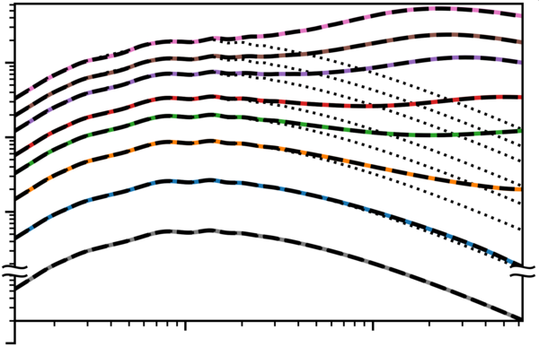

## CO*N*CEPT 1.0 data
This repository contains data and scripts used to make all figures included in
the paper
‘[The cosmological simulation code CO*N*CEPT 1.0](https://arxiv.org/abs/2112.01508)’,
which is the primary code paper for the
[CO*N*CEPT code](https://github.com/jmd-dk/concept).




### Generating figures
The figures (already present in the `figure` directory) can be regenerated by
running
```bash
python=/path/to/python make
```
where `/path/to/python` is the path to the Python interpreter to use.

This will fist parse and process the raw data files and store the results in a
[pickled](https://docs.python.org/3/library/pickle.html) format in a `.pickle`
directory (if generating the figures once more, this pickled data will be used
directly). The figures are then created from the processed data.


#### Cleanup
- The generated figures can be removed via
  ```bash
  make clean-figure
  ```
- The pickled data can be removed via
  ```bash
  make clean-pickle
  ```
- The figures as well as the pickled data can be simultaneously removed via
  ```bash
  make clean
  ```

Note that `figure/abspower.png` (displayed within this README) will not be
removed by any of these.


#### Required libraries and tools
The figure generation requires the following libraries and tools to be
installed on the system. With the exception of Python, all need to be located
on `PATH`. The version numbers given are known to work,
though many other versions will work as well.
- Python 3.9.9
  - NumPy 1.21.4
  - SciPy 1.7.3
  - Matplotlib 3.5.0
  - CLASS 2.7.2
  - Noise 1.2.2
- LaTeX, e.g. TeX Live 2019.20200218-1 (Ubuntu: `sudo apt install texlive-full`)
- Ghostscript 9.50 (Ubuntu: `sudo apt install ghostscript`)
- pdfcrop 1.38     (Ubuntu: `sudo apt install texlive-extra-utils`)
- pdfinfo 0.86.1   (Ubuntu: `sudo apt install poppler-utils`)
- (GNU) Bash 5.0.17
- (GNU) Make 4.2.1
- (GNU) grep 3.4
- GNU coreutils 8.30

The above versions of Python itself and Python packages coincide with the
versions shipping with
[CO*N*CEPT 1.0.1](https://github.com/jmd-dk/concept/tree/v1.0.1). If you have
this version of CO*N*CEPT installed, you may then use its Python distribution
to build the figures. You will however still need to install the Noise
package yourself.


### The data
The raw data (situated within the `data` directory) consists of
- Power spectrum data files of CO*N*CEPT, GADGET-2 and GADGET-4 simulations,
  all computed via CO*N*CEPT.
- Log files of CO*N*CEPT and GADGET-2 simulations.
- Memory dumps.
  - These are generated via the `memdump` script. Though not needed to
    generate the figures, this script is nontheless included in the `script`
    directory for completeness.
- The file `t_a.dat` mapping cosmic times (in Gyr) and scale factor values to
  each other, in a radiation-less cosmology with `H0 = 67*km/(s*Mpc)`,
  `Ωb = 0.049`, `Ωcdm = 0.27`, which is used for all simulations.


### The scripts
The scripts (in the `script` directory) consist of a `.py` file for each
figure. The `helper.py` file provides functionality common to the other
`.py` files. The `generate` script calls each of the `.py` files responsible
for a figure, after which it compresses the generated PDF.

As mentioned above, an additional `memdump` script is also present, though this
not used for the figure generation. The memory usage data has been recorded
using this script, which is able to accurately measure the total memory usage
of a Slurm job across multiple compute nodes.

Disclaimer: All scripts in this repository are written for their singular
purpose. Little attempt has been made to properly document, structure,
generalise or clean them up.


### Keeping this Git repository sane
If you clone this repository and regenerate the figures, Git will claim that
these have changed:
```bash
python=/path/to/python make
git status
```
However (unless something has gone wrong), only the meta data inside these
PDFs will have changed:
```bash
git diff --text figure/*
```
We thus do not want to include changes to the PDFs as actual changes to
the repository. However, since the PDFs are committed as part of
the repository, adding them to `.gitignore` will not help.
Instead do the following:
```bash
git update-index --assume-unchanged figure/*
```

