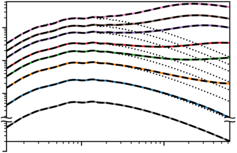

## CO*N*CEPT 1.0 data
This repository contains data and scripts used to make all figures included in
the paper
‘[The cosmological simulation code CO*N*CEPT 1.0](https://arxiv.org/abs/2112.01508)’,
which is the primary code paper for the
[CO*N*CEPT code](https://github.com/jmd-dk/concept).




### Generating figures
The figures (already present in the `figure` directory) can be regenerated by
running
```bash
python=/path/to/python make
```
where `/path/to/python` is the path to the Python interpreter to use.

This will fist parse and process the raw data files and store the results in a
[pickled](https://docs.python.org/3/library/pickle.html) format in a `.pickle`
directory (if generating the figures once more, this pickled data will be used
directly). The figures are then created from the processed data.


#### Cleanup
- The generated figures can be removed via
  ```bash
  make clean-figure
  ```
- The pickled data can be removed via
  ```bash
  make clean-pickle
  ```
- The figures as well as the pickled data can be simultaneously removed via
  ```bash
  make clean
  ```

Note that `figure/abspower.png` (displayed within this README) will not be
removed by any of these.


#### Required libraries and tools
The figure generation requires the following libraries and tools to be
installed on the system. With the exception of Python, all need to be located
on `PATH`. The version numbers given are known to work,
though many other versions will work as well.
- Python 3.9.9
  - NumPy 1.20.3, 1.21.4
  - SciPy 1.7.3
  - Matplotlib 3.5.0
  - CLASS 2.7.2
  - Noise 1.2.2
- LaTeX, e.g. TeX Live 2019.20200218-1 (Ubuntu: `sudo apt install texlive-full`)
- Ghostscript 9.50 (Ubuntu: `sudo apt install ghostscript`)
- pdfcrop 1.38     (Ubuntu: `sudo apt install texlive-extra-utils`)
- pdfinfo 0.86.1   (Ubuntu: `sudo apt install poppler-utils`)
- (GNU) Bash 5.0.17
- (GNU) Make 4.2.1
- (GNU) grep 3.4
- GNU coreutils 8.30

The above versions of Python itself and Python packages coincide with the
versions shipping with
[CO*N*CEPT 1.0.1](https://github.com/jmd-dk/concept/tree/v1.0.1). If you have
this version of CO*N*CEPT installed, you may then use its Python distribution
to build the figures. You will however still need to install the Noise
package:
```bash
(source concept && $python -m pip install noise==1.2.2)
```


### Data
The raw data (situated within the `data` directory) consists of
- Power spectrum data files of CO*N*CEPT, GADGET-2 and GADGET-4 simulations,
  all computed via CO*N*CEPT.
- Log files of CO*N*CEPT and GADGET-2 simulations.
- Memory dumps.
  - These are generated via the `memdump` script. Though not needed to
    generate the figures, this script is nontheless included in the `script`
    directory for completeness.
- The file `t_a.dat` mapping cosmic times (in Gyr) and scale factor values to
  each other, in a radiation-less cosmology with `H0 = 67*km/(s*Mpc)`,
  `Ωb = 0.049`, `Ωcdm = 0.27`, which is used for all simulations.


### Scripts
The scripts (in the `script` directory) consist of a `.py` file for each
figure. The `helper.py` file provides functionality common to the other
`.py` files. The `generate` script calls each of the `.py` files responsible
for a figure, after which it compresses the generated PDF.

As mentioned above, an additional `memdump` script is also present, though this
not used for the figure generation. The memory usage data has been recorded
using this script, which is able to accurately measure the total memory usage
of a Slurm job across multiple compute nodes.

Disclaimer: All scripts in this repository are written for their singular
purpose. Little attempt has been made to properly document, structure,
generalise or clean them up.


### Replicating simulations
In addition to the data produced from running simulations, we further provide
simulation parameter files (and more) for reproducing these simulations.
Such files files are located in the `param` directory and include
- `concept`: This is a single CO*N*CEPT parameter file capable of running any
  of the CO*N*CEPT simulations used for the figures. How to use this parameter
  file is documented within itself. This parameter file is also capable of
  producing the initial condition snapshots (used for both CO*N*CEPT and
  GADGET simulations). By default, the parameters of this file are chosen as
  to reproduce Figure 4.
- `gadget2`: This is a directory containing a GADGET-2 parameter file `param`,
  a GADGET-2 `Makefile` as well as an `outputlist` of scale factor values at
  which do dump snapshots (not including the initial and final value).
  Together, these result in a GADGET-2 simulation corresponding to Figure 4,
  or equivalently the 'standard' precision lines of the lower left panel of
  Figure 5, when combined with the results of the CO*N*CEPT simulation. With
  familiarity of GADGET-2 it should be trivial to adapt these files for
  GADGET-2 simulations used for other plots as well.
- `gadget4`: This is a directory containing a GADGET-4 parameter file `param`,
  a GADGET-4 configuration file `Config.sh` as well as the same `outputlist`
  as included for GADGET-2. Together, these result in a GADGET-4 simulation
  corresponding to the TreePM (O5) lines of Figure 6, when combined with the
  results of the CO*N*CEPT simulation. With familiarity of GADGET-4 it should
  be trivial to adapt these files for the other GADGET-4 lines shown in
  Figure 6.

While the CO*N*CEPT simulations are set up to dump power spectra directly,
both GADGET-2 and GADGET-4 will dump snapshots. To compute power spectra from
these snapshots, use the CO*N*CEPT `powerspec` utility:
```bash
./concept -u powerspec /path/to/gadget-snapshot -p /path/to/this/repo/param/concept
```
where the supplied CO*N*CEPT parameter file supplies the power spectrum
settings. You are advised to further supply a decent number of processes
(`-n`) and probably submit the power spectrum computation as a remote
job (`-q`). See the CO*N*CEPT
[documentation](https://jmd-dk.github.io/concept/) for details, in particular
the tutorial section about
[comparisons between CO*N*CEPT and GADGET-2](https://jmd-dk.github.io/concept/tutorial/gadget.html),
which also demonstrates how one can automatically generate the GADGET-2
parameter and `Makefile` from the CO*N*CEPT parameter file.

The specific code versions used to generate the data included in this
repository are
[CO*N*CEPT 1.0.0](https://github.com/jmd-dk/concept/tree/v1.0.1),
[GADGET 2.0.7](https://wwwmpa.mpa-garching.mpg.de/gadget/) and Git commit
[8a10478b3e62d202808407e40a5f94a8b5e88d80 of GADGET-4](https://gitlab.mpcdf.mpg.de/vrs/gadget4/-/tree/8a10478b3e62d202808407e40a5f94a8b5e88d80).

The values of physical constants within the
GADGET-2 and GADGET-4 codes have been slightly adjusted to match the values
used within CO*N*CEPT 1.0. The adjusted values are as follows.
- GADGET-2, `allvars.h`:
  ```c
  #define GRAVITY          6.6743e-08
  #define SOLAR_MASS       1.98841e+33
  #define C                29979245800.0
  #define PLANCK           6.62607015e-27
  #define CM_PER_MPC       3.0856775814913676e+24
  #define HUBBLE           3.2407792894443648e-18
  #define SEC_PER_MEGAYEAR 3.15576e+13
  #define SEC_PER_YEAR     31557600.0
  ```
- GADGET-4, `constants.h`:
  ```c
  #define GRAVITY    6.6743e-08
  #define SOLAR_MASS 1.98841e+33
  #define PARSEC     3.0856775814913676e+18
  #define HUBBLE     3.2407792894443648e-18
  ```

If using the GADGET-2 that comes with CO*N*CEPT, these adjustment are already
in place.

As stated, by default the parameter files are set up to reproduce Figure 4
(as well as parts of Figures 5 and 6). For this, only a single initial
condition snapshot needs to be generated (handled by the CO*N*CEPT parameter
file). In order to obtain exactly the same particle realisation as used for
the corresponding data included in this repository, you must use a NumPy
version below 1.21, due to a
[change](https://github.com/numpy/numpy/commit/d4a270640b451636c76cb7cff52cc5a1a8a12b6c)
to the way random Rayleigh numbers are constructed. Thus, if you use CO*N*CEPT
1.0 and wants to exactly replicate the power spectra included in this
repository, make sure to first downgrade to e.g. NumPy 1.20.3:
```bash
(source concept && $python -m pip install numpy==1.20.3)
```

Note that though all CO*N*CEPT simulations used for the figures can be
replicated using the provided CO*N*CEPT parameter file, figures showing
statistics internal to the code are not trivially reproducible, as these
typically require print-outs of said statistics to be placed within the code,
or external monitoring of the program while it is running.


### Keeping this Git repository sane
If you clone this repository and regenerate the figures, Git will claim that
these have changed:
```bash
python=/path/to/python make
git status
```
However (unless something has gone wrong), only the meta data inside these
PDFs will have changed:
```bash
git diff --text figure/*.pdf
```
We thus do not want to include changes to the PDFs as actual changes to
the repository. However, since the PDFs are committed as part of
the repository, adding them to `.gitignore` will not help.
Instead do the following:
```bash
git update-index --assume-unchanged figure/*.pdf
```

